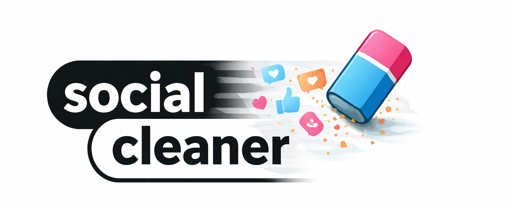
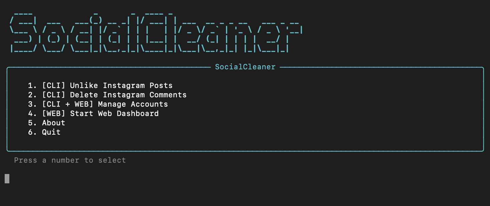
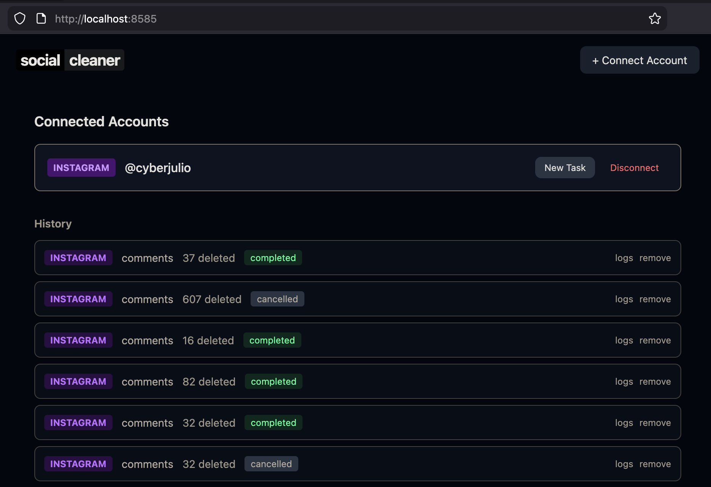

<p align="center">
  
</p>

A self-hosted tool for bulk-removing your likes and comments from Instagram
(and eventually Twitter/X). It runs entirely on your machine -- your
credentials never leave your computer.

SocialCleaner uses browser automation (Playwright) to interact with
Instagram's web interface the same way you would manually, just faster.

## How it works

SocialCleaner can be used via the **CLI** (terminal menu) or the **Web Dashboard**.

1. You connect your Instagram account by logging in through a browser window
   that SocialCleaner opens for you (available in both CLI and Web Dashboard).
   Alternatively, the Web Dashboard offers console snippet and manual cookie
   paste as fallback methods.
2. SocialCleaner opens a headless browser with your session and navigates to
   **Your Activity > Likes** or **Your Activity > Comments**.
3. It selects items in small batches, clicks Unlike/Delete, and confirms
   each removal before moving on.
4. Progress is shown live — in a terminal progress bar (CLI) or streamed
   to the web dashboard via server-sent events.

Your cookies are encrypted at rest with Fernet (AES-128-CBC) and stored in a
local SQLite database. Nothing is sent to any external server. Both the CLI
and web dashboard share the same database — accounts and tasks are visible
in either interface.

## Requirements

- Python 3.10 or later
- A display server (the browser login flow opens a visible Firefox window)
- Node.js 18 or later (only if you want the web dashboard)

## Installation

### macOS

```bash
# Clone the repository
git clone https://github.com/cyberjulio/socialcleaner.git
cd socialcleaner

# Create and activate a Python virtual environment
python3 -m venv venv
source venv/bin/activate

# Install Python dependencies
pip install -r requirements.txt

# Install Playwright browsers (Firefox is used for automation)
playwright install firefox

# Create your environment file with a random secret key
# (required — the app won't start without it)
python3 -c "import secrets; print('CLEANER_SECRET_KEY=' + secrets.token_urlsafe(32))" > .env

# (Optional) Build the web dashboard — only needed if you want the web UI
cd frontend && npm install && npm run build && cd ..
```

### Linux (Debian/Ubuntu)

```bash
# Install system dependencies for Playwright
sudo apt-get update
sudo apt-get install -y python3 python3-venv nodejs npm

# Clone the repository
git clone https://github.com/cyberjulio/socialcleaner.git
cd socialcleaner

# Create and activate a Python virtual environment
python3 -m venv venv
source venv/bin/activate

# Install Python dependencies
pip install -r requirements.txt

# Install Playwright browsers and their system dependencies
playwright install firefox
playwright install-deps firefox

# Create your environment file with a random secret key
# (required — the app won't start without it)
python3 -c "import secrets; print('CLEANER_SECRET_KEY=' + secrets.token_urlsafe(32))" > .env

# (Optional) Build the web dashboard — only needed if you want the web UI
cd frontend && npm install && npm run build && cd ..
```

## Running

### Option A: CLI (recommended)

The CLI provides a menu-driven interface with no browser needed for setup:

```bash
source venv/bin/activate
python -m cli
```

This launches an interactive menu:

```
  1. [CLI] Unlike Instagram Posts
  2. [CLI] Delete Instagram Comments
  3. [CLI + WEB] Manage Accounts
  4. [WEB] Start Web Dashboard
  5. About
  6. Quit
```

Press a number to navigate — no Enter key needed.

### Option B: Web Dashboard

You can also launch the web dashboard from the CLI (option 4), or start it
directly:

```bash
source venv/bin/activate
uvicorn backend.main:app --host 127.0.0.1 --port 8647
```

Open http://127.0.0.1:8647 in your browser.

## Connecting your Instagram account

### Via CLI (recommended)

1. Launch the CLI: `python -m cli`
2. Press **3** (Manage Accounts) then **1** (Add Instagram Account)
3. A Firefox browser window opens to the Instagram login page
4. Log in normally — handle 2FA if prompted
5. The CLI detects when you're logged in and saves your session

### Via Web Dashboard

1. Click **+ Connect Account** on the dashboard.
2. Choose **Instagram**.
3. Choose a connection method:
   - **Log in with browser** (recommended): opens a Firefox window where you
     log in normally. Cookies are captured automatically.
   - **Console snippet**: paste a JavaScript snippet into the browser console
     on instagram.com to extract cookies.
   - **Manual cookie paste**: open DevTools > Storage > Cookies on
     instagram.com and copy the required values (`sessionid`, `csrftoken`,
     `ds_user_id`).
4. Once connected, your account appears on the dashboard with action buttons.

Accounts are shared between CLI and web — add once, use in either.

## Usage

### CLI

<p align="center">
  
</p>

- **Unlike Instagram Posts** (option 1) — removes all your likes
- **Delete Instagram Comments** (option 2) — removes all your comments
- Live progress bar shows count, speed, and estimated time
- Press **Q** to stop (progress is saved), **P** to pause/resume
- If you stop mid-task, the CLI will offer to resume next time

### Web Dashboard

<p align="center">
  
</p>

- **Unlike All** -- removes all your likes, newest first.
- **Delete Comments** -- removes all your comments.
- **Cancel** -- stops a running task. Progress is saved and you can see
  historical tasks with their logs.

Tasks run in the background. You can close the browser tab and come back
later; the backend continues processing.

## Project structure

```
socialcleaner/
  cli/
    __main__.py        CLI entry point (python -m cli)
    app.py             Main menu loop and signal handling
    auth.py            Interactive browser login and account management
    tasks.py           Task execution with rich progress display
    display.py         Shared rich TUI components
  backend/
    main.py            FastAPI application entry point
    config.py          Settings (secret key, DB path)
    database.py        SQLite schema and connection
    platforms/
      instagram.py     Instagram automation (likes, comments)
      twitter.py       Twitter/X automation (stub)
    routers/
      auth.py          Session management endpoints
      tasks.py         Task CRUD and SSE streaming
    utils/
      crypto.py        Fernet encryption for cookie storage
      events.py        Server-sent event bus
    worker/
      engine.py        Task execution engine (with TaskEventSink protocol)
      rate_limiter.py  Adaptive rate limiting
  frontend/
    src/
      App.jsx          Main application shell
      api.js           Backend API client
      components/
        Dashboard.jsx  Connected accounts and task list
        TaskCard.jsx   Task progress display with live logs
        CookieWizard.jsx  Account connection flow
```

## Important notes

- This tool automates actions on your own account. Use it responsibly.
- Sessions created via browser login (CLI or Web) use a generic Firefox
  user-agent. Sessions created via cookie paste in the Web Dashboard
  capture the user-agent from the browser used to access the dashboard,
  so the headless browser's requests match your normal browsing session.
- Instagram may temporarily restrict your account if you remove content
  too quickly. SocialCleaner includes rate limiting and automatic pauses,
  but there is always some risk.
- Session cookies expire. If you see "No accounts connected" after a
  restart, reconnect your account.
- The database and browser data are stored locally. Back up `cleaner.db`
  if you want to preserve your task history.

## Rate limiting and anti-detection

SocialCleaner is designed to run unattended for days, processing large
volumes of likes and comments without triggering Instagram's automation
detection. The rate limiting strategy is based on community research
across automation forums, GitHub projects, and real-world experience.

### How it works

Tasks process items in batches of 20-25 (matching Instagram's own
native UI cap of 25 selections). Between each batch, the tool waits a
random 20-45 seconds before starting the next one. Individual clicks
within a batch are spaced 200-600ms apart with randomization to avoid
fixed-timing detection.

### Session and daily limits

| Parameter              | Value            | Purpose                                      |
|------------------------|------------------|----------------------------------------------|
| Batch size             | 20-25 (random)   | Matches Instagram's native selection cap      |
| Click delay            | 200-600ms        | Randomized per click to mimic human input     |
| Inter-batch delay      | 20-45 seconds    | Community-recommended safe window             |
| Reading pause          | 20% chance, 3-8s | Simulates human scanning between actions      |
| Session active limit   | 50 minutes       | Max continuous operation before mandatory rest |
| Session rest           | 30-45 minutes    | Break between active sessions                 |
| Daily cap              | 800 actions      | Under the moderate-risk threshold of 1,000    |

### Action block detection

After each batch, SocialCleaner checks the page for Instagram block
indicators ("Try Again Later", "Action Blocked", "We restrict certain
activity"). If detected, all activity pauses for 24 hours to prevent
escalation from a temporary soft block to a longer restriction.

### Estimated duration

When a task starts, SocialCleaner calculates an estimated duration based
on the number of items, batch processing time, inter-batch delays,
session rests, and the daily cap. For example:

- 80 items: approximately 28 minutes
- 800 items: approximately 1 day
- 5,000 items: approximately 7 days (processing 800 items/day)

### Instagram rate limit reference

These numbers are community-derived (Instagram does not publish official
limits) and represent conservative safe thresholds:

| Action type     | Safe per hour | Safe per day | Risk threshold |
|-----------------|---------------|--------------|----------------|
| Likes / Unlikes | 30-50         | 500-1,000    | >1,000/day     |
| Comments        | 20            | 150-200      | >200/day       |
| Follows         | 30            | 500          | >500/day       |
| Combined total  | --            | 300-800      | >1,000/day     |

Action blocks escalate with repeated violations:

1. Soft block (single action type, few hours to 24h)
2. Temporary block (24-48h, shows expiration)
3. Extended block (days to 2 weeks, no expiration shown)
4. Full restriction (up to 30 days)
5. Suspension (180 days or permanent)

Continuing automated actions during a block extends its duration.
SocialCleaner detects blocks and stops automatically to avoid this.

## Security

SocialCleaner is designed to run locally on your own machine. Your
credentials never leave your computer.

- **Encrypted storage**: Session cookies are encrypted at rest using
  Fernet (AES-128-CBC + HMAC). The encryption key is derived from
  `CLEANER_SECRET_KEY` in your `.env` file.
- **No external connections**: The backend only binds to `127.0.0.1`.
  No data is sent to any external server.
- **Database permissions**: `cleaner.db` is created with owner-only
  permissions (600) to prevent other local users from reading it.
- **Secret key is required**: The app will not start without a
  `CLEANER_SECRET_KEY` in `.env`. If you lose this key, stored sessions
  cannot be recovered — you'll need to reconnect your accounts.

Do not expose the web dashboard to the network (e.g., by binding to
`0.0.0.0`). It has no authentication layer and is intended for
single-user local use only.

## Disclaimer

This software is provided "as is", without warranty of any kind, express
or implied. Use it entirely at your own risk.

By using SocialCleaner, you acknowledge and agree that:

1. **You are solely responsible** for how you use this tool and for any
   consequences that result from its use, including but not limited to
   account restrictions, suspensions, or permanent bans imposed by
   Instagram, Twitter/X, or any other platform.
2. **This tool interacts with third-party platforms** in ways that may
   violate their Terms of Service. The authors do not encourage or endorse
   violating any platform's terms. It is your responsibility to review and
   comply with the terms of any service you use this tool with.
3. **The authors and contributors accept no responsibility** for any
   damages, data loss, account loss, legal consequences, or other harm
   arising from the use or misuse of this software.
4. **No guarantee of functionality** is provided. Platform interfaces
   change without notice, and this tool may stop working, behave
   unexpectedly, or cause unintended actions on your accounts at any time.
5. **You are responsible for your own data.** Session cookies and
   credentials are stored locally on your machine. The authors are not
   responsible for unauthorized access to your data resulting from
   misconfiguration, system compromise, or any other cause.

This project is not affiliated with, endorsed by, or sponsored by
Instagram, Meta, Twitter/X, or any other platform.

## License

This project is licensed under [CC BY-NC 4.0](LICENSE). You are free to
use, modify, and share it for non-commercial purposes. Commercial use is
not permitted.
